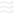

<h1 align="left">
  
  Stratify
</h1>

<p align="center">
  An interactive two-phase stratified flow simulation demonstrating fluid mechanics principles in a horizontal pipe.
</p>

<p align="center">
  
  
  
</p>

## Overview

Stratify simulates the flow of two immiscible fluids (oil and water) in a horizontal pipe, demonstrating key fluid mechanics concepts including:

- **Stratified flow patterns**
- **Viscous coupling between fluid layers**
- **No-slip boundary conditions**
- **Parabolic velocity profiles (Poiseuille flow)**
- **Interface dynamics**

---

## Theoretical Background

### 1. Stratified Two-Phase Flow

When two immiscible fluids with different densities flow through a horizontal pipe at low velocities, they naturally stratify due to gravity. The lighter fluid (oil) occupies the upper portion while the denser fluid (water) flows below.

```
    ┌────────────────────────────────────┐
    │  ~~~~~~~~ Upper Fluid (Oil) ~~~~~~~│  ρ₁, μ₁
    │════════════ Interface ═════════════│  y = 0
    │  ≋≋≋≋≋≋≋≋ Lower Fluid (Water) ≋≋≋≋│  ρ₂, μ₂
    └────────────────────────────────────┘
```

### 2. Poiseuille Flow (Parabolic Velocity Profile)

For a single-phase laminar flow in a pipe, the velocity profile follows a parabolic distribution known as **Hagen-Poiseuille flow**:

$$u(r) = u_{max} \left(1 - \frac{r^2}{R^2}\right)$$

Where:

- $u(r)$ = velocity at radial position $r$
- $u_{max}$ = maximum velocity at pipe center
- $R$ = pipe radius
- $r$ = radial distance from center

The maximum velocity relates to the pressure gradient by:

$$u_{max} = \frac{\Delta P \cdot R^2}{4 \mu L}$$

**Key insight**: Velocity is **inversely proportional to viscosity** ($\mu$). Higher viscosity fluids flow slower under the same pressure gradient.

### 3. No-Slip Boundary Condition

At solid boundaries (pipe walls), the fluid velocity must equal zero:

$$u(r = R) = 0$$

This fundamental principle means:

- Fluid particles in direct contact with the wall are stationary
- Velocity gradually increases toward the center
- Creates a boundary layer near the wall

### 4. Interface Velocity & Shear Stress Continuity

At the interface between two fluids, two conditions must be satisfied:

#### a) Velocity Continuity

Both fluids must have the same velocity at the interface:

$$u_1|_{interface} = u_2|_{interface} = u_i$$

#### b) Shear Stress Continuity

The shear stress must be continuous across the interface:

$$\tau_1 = \tau_2$$

$$\mu_1 \frac{\partial u_1}{\partial y}\bigg|_{interface} = \mu_2 \frac{\partial u_2}{\partial y}\bigg|_{interface}$$

From these conditions, the **interface velocity** can be derived:

$$u_i = \frac{\mu_1 \cdot U_1 + \mu_2 \cdot U_2}{\mu_1 + \mu_2}$$

Where:

- $U_1$, $U_2$ = bulk/driving velocities of each fluid
- $\mu_1$, $\mu_2$ = dynamic viscosities

**Physical interpretation**: The more viscous fluid has a stronger influence on the interface velocity because it resists velocity gradients more effectively.

### 5. Viscous Coupling (Momentum Transfer)

When one fluid flows and the other is stationary, momentum is transferred across the interface through **viscous drag**:

```
    Fast-moving fluid  ────────────→  Drags the interface
                         ↕ Shear stress
    Slow/stationary fluid ─────→      Gets dragged along
```

The drag force is proportional to:

- The velocity difference between fluids
- **Inversely** proportional to viscosity (more viscous = slower response)

$$F_{drag} \propto \frac{\Delta u}{\mu}$$

This explains why:

- A stationary viscous fluid still moves slightly due to drag from the flowing fluid
- High viscosity fluids resist being dragged and respond more slowly

### 6. Velocity Profile in Stratified Flow

The complete velocity profile combines:

1. **Native Poiseuille flow** - What each fluid would do independently
2. **Interface coupling** - Blending toward the shared interface velocity

For each fluid layer:

$$u(y) = u_i \cdot (1 - \beta) + u_{native}(y) \cdot \beta$$

Where $\beta$ is a blending function based on distance from interface:

$$\beta = \left(\frac{|y|}{H}\right)^n$$

- At interface ($y = 0$): $\beta = 0$, velocity = $u_i$
- At wall ($y = H$): $\beta = 1$, velocity = 0 (no-slip)

---

## Simulation Parameters

| Parameter         | Symbol  | Unit | Range    |
| ----------------- | ------- | ---- | -------- |
| Flow Rate (Upper) | $U_1$   | m/s  | -2 to +2 |
| Flow Rate (Lower) | $U_2$   | m/s  | -2 to +2 |
| Viscosity (Upper) | $\mu_1$ | Pa·s | 0.5 to 5 |
| Viscosity (Lower) | $\mu_2$ | Pa·s | 0.5 to 5 |

### Interesting Scenarios to Explore

1. **Counter-flow**: Set opposite flow directions (e.g., upper = +1, lower = -1)
2. **Viscous dragging**: Set one flow to 0, observe how the other drags it
3. **High viscosity contrast**: See how interface velocity shifts toward the more viscous fluid
4. **Equal conditions**: Both fluids at same rate and viscosity should show symmetric profiles

---

## Controls

| Action            | Control               |
| ----------------- | --------------------- |
| Rotate view       | Left-click + drag     |
| Zoom              | Scroll wheel          |
| Adjust parameters | Control panel sliders |

---

## Technical Implementation

### Particle System

- 8,000 particles per fluid phase
- Position updated using velocity integration
- Periodic boundary conditions at pipe ends

### Physics Engine

- Real-time velocity profile calculation
- Interface velocity computed from viscosity-weighted average
- Boundary layer enforcement near walls

### Rendering

- Three.js WebGL renderer
- Custom particle shaders for spherical appearance
- Depth-sorted rendering for proper visibility

---

## Getting Started

### Prerequisites

- Node.js 18+
- pnpm (recommended) or npm

### Installation

```bash
# Clone the repository
git clone https://github.com/ErenDexter/Stratify.git
cd Stratify

# Install dependencies
pnpm install

# Start development server
pnpm dev
```

### Build for Production

```bash
pnpm build
pnpm preview
```

---

## References

1. Bird, R.B., Stewart, W.E., & Lightfoot, E.N. (2002). _Transport Phenomena_. John Wiley & Sons.
2. White, F.M. (2011). _Fluid Mechanics_. McGraw-Hill.
3. Brennen, C.E. (2005). _Fundamentals of Multiphase Flow_. Cambridge University Press.
4. Taitel, Y., & Dukler, A.E. (1976). A model for predicting flow regime transitions in horizontal and near horizontal gas-liquid flow. _AIChE Journal_, 22(1), 47-55.

---

## License

MIT License - feel free to use, modify, and distribute.

---

## Author

**Ranat Das Prangon**

[](https://github.com/ErenDexter)

---

<p align="center">
  Built with ❤️ using SvelteKit, Three.js, and TailwindCSS
</p>
